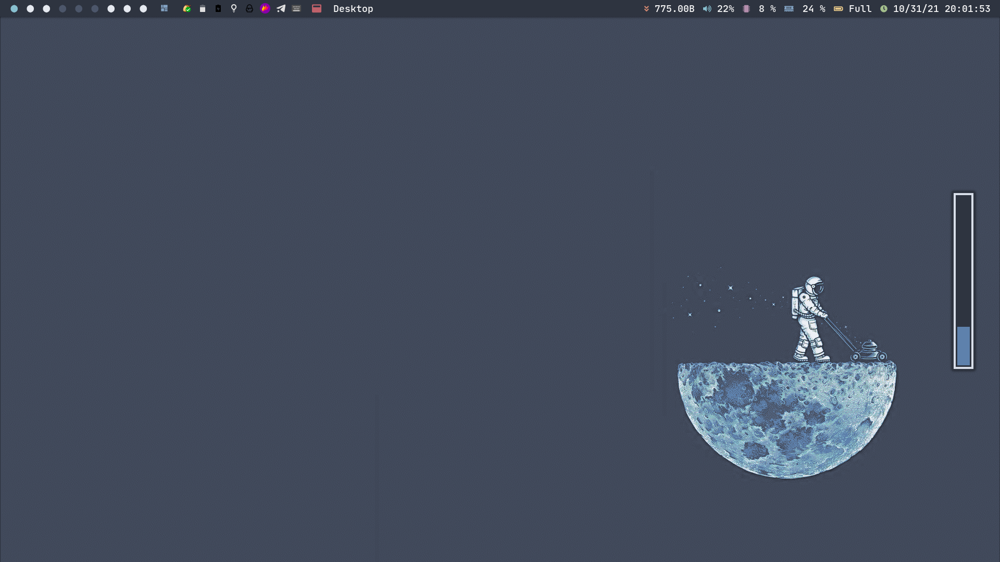
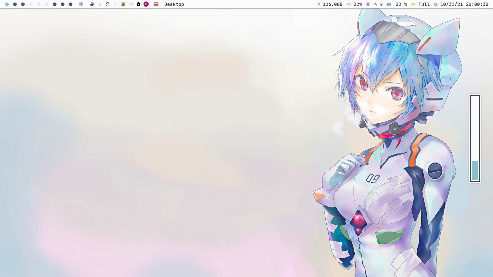

# Intro

This repo include 3 color scheme's config:

- [Catppuccin](./catppuccin)
- [Gruvbox](./gruvbox)
- [Nord](./nord)

Each of them(except `Catppuccin`) include global Dark and Light color scheme which can be switch through a simple script.

The Nord version have 2 dwm builds, one is [Original Dwm](./nord/.dwm-ori), the other is [Dwm with polybar](./nord/.dwm-po)(support switch during runtime).

Besides, there is a [qtile config](./nord/.config/qtile) using nord theme, which share the light-dark switch script with dwm.

This is my neovim's [configuration](https://github.com/ayamir/nvimdots).

# Shot

## Catppuccin

## Gruvbox

## Nord

1. Original Dwm

   

   

2. Dwm with polybar

   

   

3. Qtile

   

   
