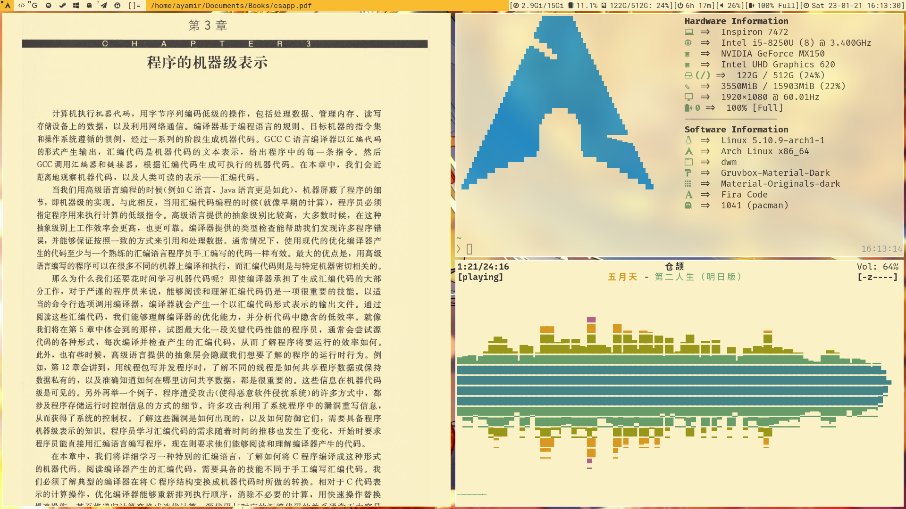
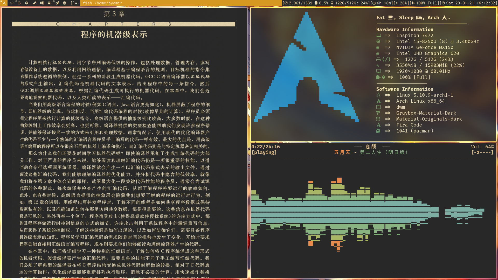

# Table of Contents

1.  [My Own Dwm Config](#org27716e3)
    1.  [Color Scheme](#org4976554)
    2.  [Patches](#org2026491)
    3.  [Keybinding](#orgdf423ab)
    4.  [Other](#org1958ae2)
        1.  [Xsessions config](#org1745859)
        2.  [Switch](#switch)
        3.  [Recompile](#org3f8fde8)
        4.  [Telegram Themes](#tg)


<a id="org27716e3"></a>

# My Own Dwm Config


<a id="org4976554"></a>

## Color Scheme

Gruvbox





<a id="org2026491"></a>

## Patches

You can see all of 8 patches I have applied in `./patches` dir.

-   dwm-00-regex-rules.diff
    
    to enable `config.def.h` 's regex rules

-   dwm-gridmode-20170909-ceac8c9.diff
    
    add a grid layout

-   dwm-6.2-tab-v2b.diff
    
    convert monocule layout to tab layout

-   dwm-restartsig-20180523-6.2.diff
    
    make dwm can restart through a shortcut

-   dwm-autostart-20200610-cb3f58a.diff
    
    enable autostart apps when dwm start or restart(my script ensures apps only start when dwm starts for the first time)

-   dwm-focusmaster-20200717-bb2e722.diff
    
    let you can focus master window through a shortcut

-   dwm-uselessgap-6.2.diff
    
    gap appears only two or more windows appear


<a id="orgdf423ab"></a>

## Keybinding

You can see all of keybindings in `./config.def.h` clearly.


<a id="org1958ae2"></a>

## Other


<a id="org1745859"></a>

### Xsessions config

Execute `recompile` script first.

Then add xsession file manually.

`sudo vim /usr/share/xsessions/dwm.desktop`

```shell
[Desktop Entry]
Encoding=UTF-8
Name=Dwm
Comment=Dynamic window manager
Exec=dwm
Icon=dwm
Type=XSession
```

<a id="switch"></a>

### Switch

The simple script in `.local/bin/` called `switch-gruvbox` can switch `gruvbox-light` and `gruvbox-dark` theme through a shortcut defined in `.dwm/config.def.h`.

All of details about how to switch you can see in it.

<a id="org3f8fde8"></a>

### Recompile

The script called `recompile` need your user can execute `sudo` command without password.

<a id="tg"></a>

### Telegram Themes

Please refer this: [Gruvbox-Tg](https://github.com/ayamir/Gruvbox-Tg)
