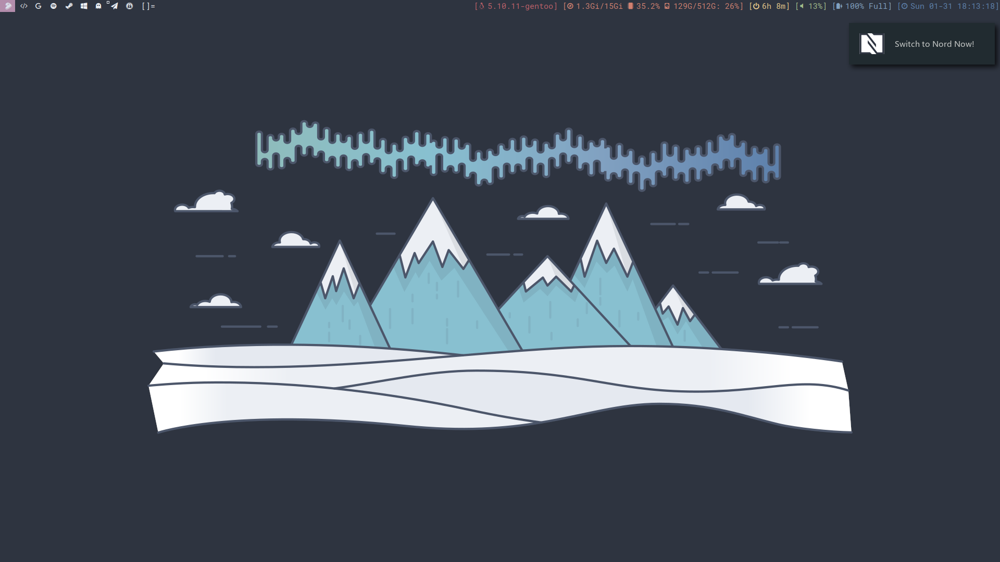
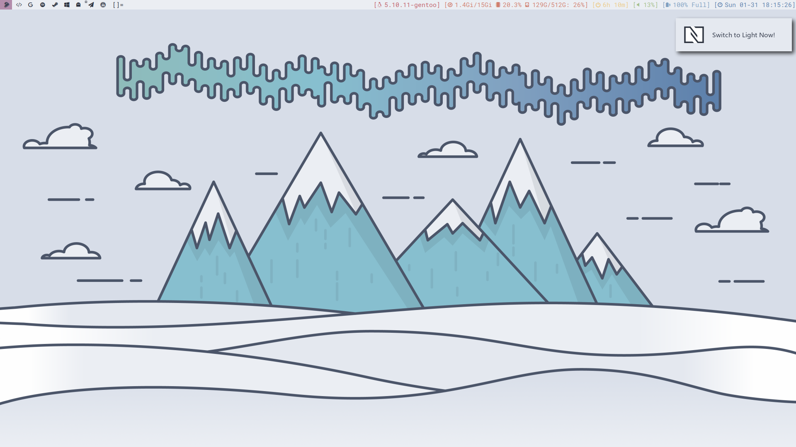
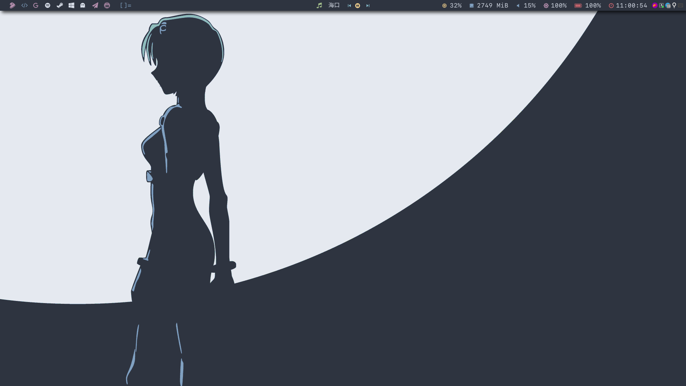
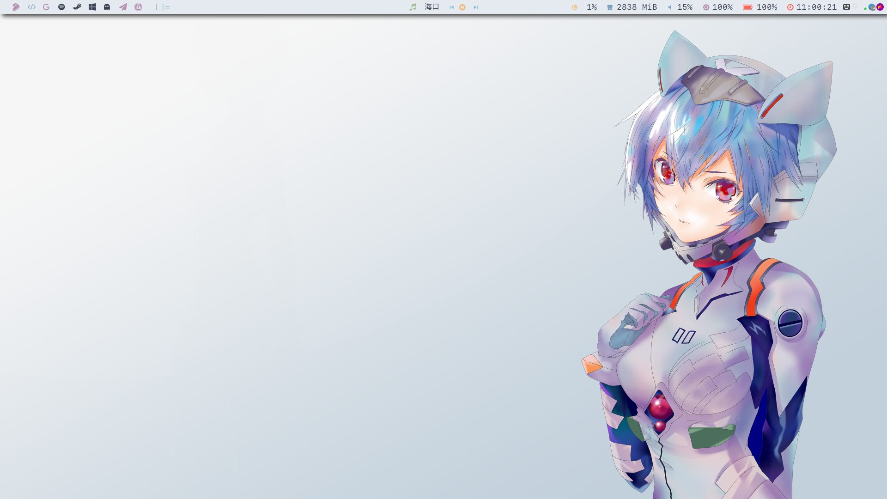

# Intro

This repo include 2 color scheme's config, one is [Gruvbox](./gruvbox), the other is [Nord](./nord).

Each of them include global Dark and Light color scheme which can be switch through a simple script.

The Nord version have 2 dwm builds, one is [Original Dwm](./nord/.dwm-ori), the other is [Dwm with polybar](./nord/.dwm-po)(support switch during runtime).

# Shot

## Gruvbox

## Nord

1. Original Dwm

    

    

2. Dwm with polybar

    

    
