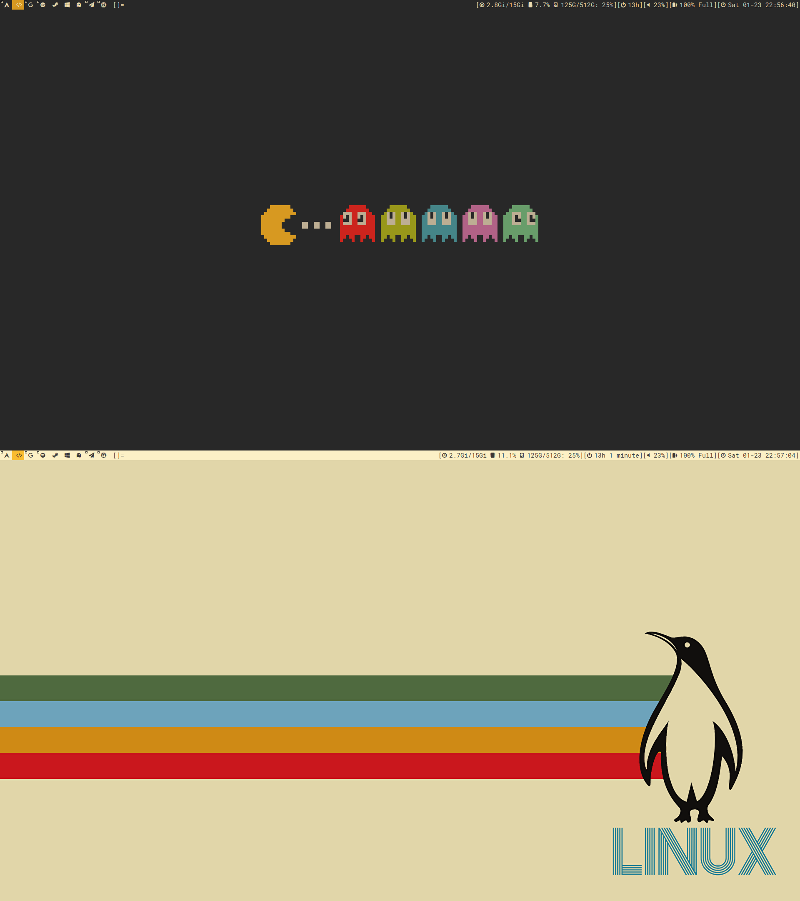
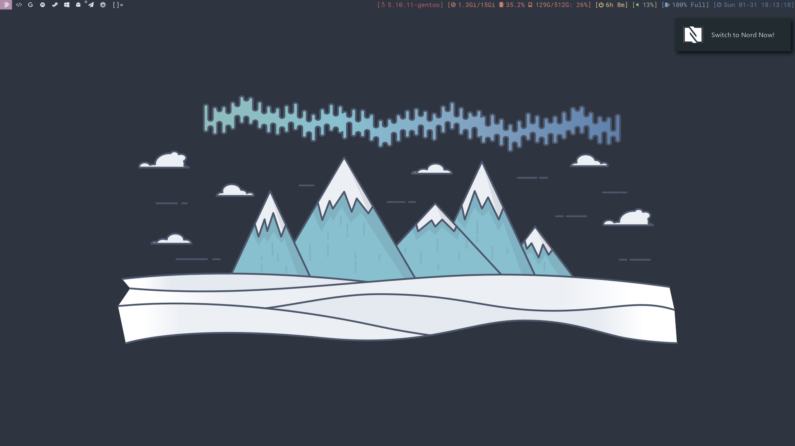
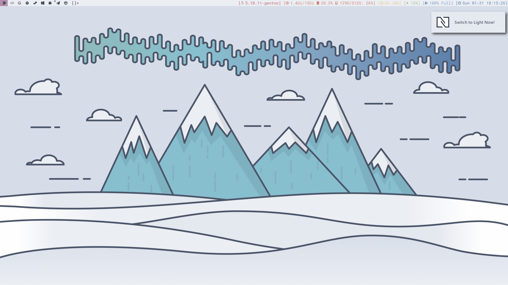
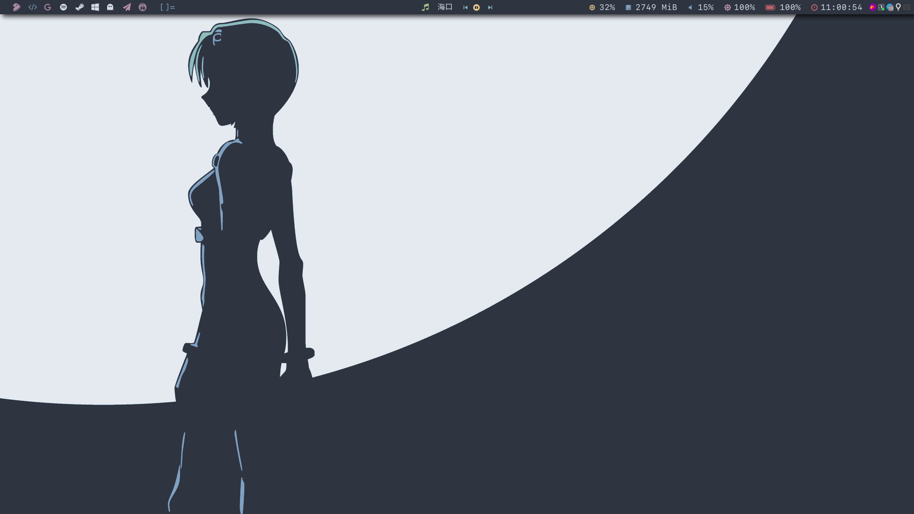
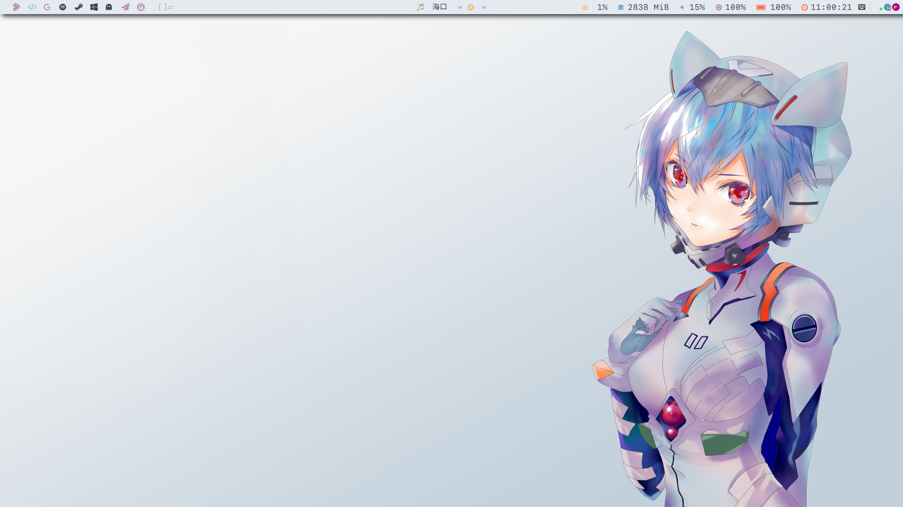
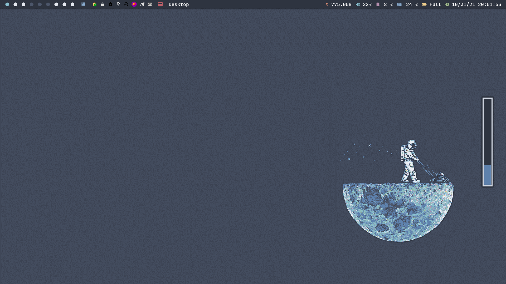
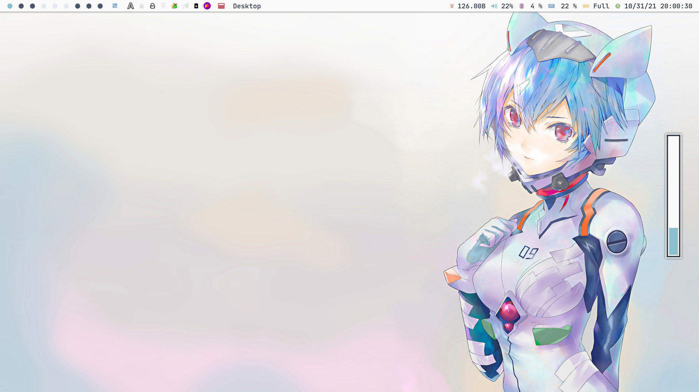

# Intro

## Zsh config

Portable, framework-free zsh setup in [`zsh/`](./zsh). Works on macOS (Apple Silicon + Intel) and Linux: no hardcoded paths, and every third-party tool is optional — a missing one is skipped instead of printing an error on startup.

```sh
bash zsh/setup.sh --dry-run   # 先看会做什么
bash zsh/setup.sh             # 装机
```

包管理按平台自动选：Omarchy 走 `omarchy pkg add` / `omarchy pkg aur add`（Omarchy 自己决定 pacman、AUR、sudo），其他 Arch 走 `pacman` + `yay`/`paru`，macOS 走 Homebrew。插件路径（`/usr/share/zsh/plugins/...` 与 brew 的 `/opt/homebrew/...`）都在 `zshrc` 里探测。

- `zsh/zshrc` — 配置本体。Homebrew 前缀、插件位置全部运行时探测。
- `zsh/user-abbreviations` — zsh-abbr 缩写（`ls`→eza、`cat`→bat、git 快捷方式…）。
- `zsh/versions.lock` — 环境快照（zsh 与各工具精确版本）；`bash zsh/setup.sh --snapshot` 重写，装完会自动逐项比对。
- `zsh/setup.sh` — 装依赖、备份并软链 `~/.zshrc`，装完核对版本。
- `~/.zshrc.local` — 机器/个人专属配置，最后加载。默认不进 Git；本机这份收在 [`omarchy/zshrc.local`](./omarchy/zshrc.local)。

## Omarchy config

My [Omarchy](https://omarchy.org/) desktop overrides live in [`omarchy/`](./omarchy): Hyprland workspace/window placement (ported from [`catppuccin/.config/awesome/rc.lua`](./catppuccin/.config/awesome/rc.lua)), terminals, starship prompt, Omarchy shell bar.

```sh
bash omarchy/install.sh --dry-run   # 先看会做什么
bash omarchy/install.sh             # 装机：备份 → 软链/复制 → hyprctl 校验 → 重启 shell
bash omarchy/install.sh --save      # 把会被程序改写的文件同步回仓库
```

Only files that differ from Omarchy's defaults are kept; everything else still comes from the `omarchy` package. See [`omarchy/README.md`](./omarchy/README.md).

同一份配置镜像在 [chip-os/global_script `zsh/`](https://github.com/chip-os/global_script/tree/main/zsh)，那边不依赖本仓库，可单独 clone 给新机器用；在哪个目录跑 `setup.sh`，`~/.zshrc` 就指向哪一份。

---

This repo include 3 color scheme's config:

- [Catppuccin](./catppuccin)
- [Gruvbox](./gruvbox)
- [Nord](./nord)

Each of them(except `Catppuccin`) include global Dark and Light color scheme which can be switch through a simple script.

The Nord version have 2 dwm builds, one is [Original Dwm](./nord/.dwm-ori), the other is [Dwm with polybar](./nord/.dwm-po)(support switch during runtime).

Besides, there is a [qtile config](./nord/.config/qtile) using nord theme, which share the light-dark switch script with dwm.

This is my neovim's [configuration](https://github.com/ayamir/nvimdots).

# Shot

## Catppuccin


## Gruvbox



## Nord

1. Original Dwm

   

   

2. Dwm with polybar

   

   

3. Qtile

   

   
