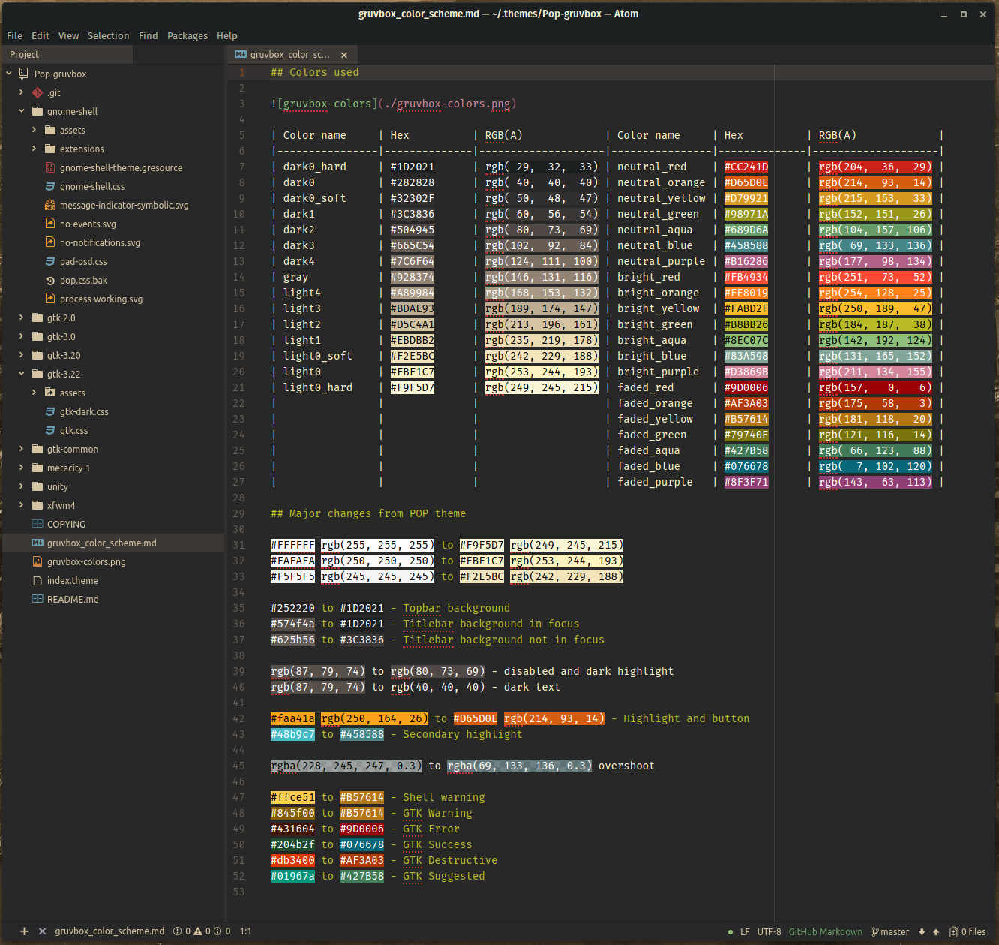

## Colors used

| Color name     | Hex          | RGB(A)             | Color name     | Hex          | RGB(A)             |
|----------------|--------------|--------------------|----------------|--------------|--------------------|
| dark0_hard     | #1D2021      | rgb( 29,  32,  33) | neutral_red    | #CC241D      | rgb(204,  36,  29) |
| dark0          | #282828      | rgb( 40,  40,  40) | neutral_orange | #D65D0E      | rgb(214,  93,  14) |
| dark0_soft     | #32302F      | rgb( 50,  48,  47) | neutral_yellow | #D79921      | rgb(215, 153,  33) |
| dark1          | #3C3836      | rgb( 60,  56,  54) | neutral_green  | #98971A      | rgb(152, 151,  26) |
| dark2          | #504945      | rgb( 80,  73,  69) | neutral_aqua   | #689D6A      | rgb(104, 157, 106) |
| dark3          | #665C54      | rgb(102,  92,  84) | neutral_blue   | #458588      | rgb( 69, 133, 136) |
| dark4          | #7C6F64      | rgb(124, 111, 100) | neutral_purple | #B16286      | rgb(177,  98, 134) |
| gray           | #928374      | rgb(146, 131, 116) | bright_red     | #FB4934      | rgb(251,  73,  52) |
| light4         | #A89984      | rgb(168, 153, 132) | bright_orange  | #FE8019      | rgb(254, 128,  25) |
| light3         | #BDAE93      | rgb(189, 174, 147) | bright_yellow  | #FABD2F      | rgb(250, 189,  47) |
| light2         | #D5C4A1      | rgb(213, 196, 161) | bright_green   | #B8BB26      | rgb(184, 187,  38) |
| light1         | #EBDBB2      | rgb(235, 219, 178) | bright_aqua    | #8EC07C      | rgb(142, 192, 124) |
| light0_soft    | #F2E5BC      | rgb(242, 229, 188) | bright_blue    | #83A598      | rgb(131, 165, 152) |
| light0         | #FBF1C7      | rgb(253, 244, 193) | bright_purple  | #D3869B      | rgb(211, 134, 155) |
| light0_hard    | #F9F5D7      | rgb(249, 245, 215) | faded_red      | #9D0006      | rgb(157,   0,   6) |
|                |              |                    | faded_orange   | #AF3A03      | rgb(175,  58,   3) |
|                |              |                    | faded_yellow   | #B57614      | rgb(181, 118,  20) |
|                |              |                    | faded_green    | #79740E      | rgb(121, 116,  14) |
|                |              |                    | faded_aqua     | #427B58      | rgb( 66, 123,  88) |
|                |              |                    | faded_blue     | #076678      | rgb(  7, 102, 120) |
|                |              |                    | faded_purple   | #8F3F71      | rgb(143,  63, 113) |

## Major changes from POP theme

#FFFFFF rgb(255, 255, 255) to #F9F5D7 rgb(249, 245, 215)  
#FAFAFA rgb(250, 250, 250) to #FBF1C7 rgb(253, 244, 193)  
#F5F5F5 rgb(245, 245, 245) to #F2E5BC rgb(242, 229, 188)  

#252220 to #1D2021 - Topbar background  
#574f4a to #1D2021 - Titlebar background in focus  
#625b56 to #3C3836 - Titlebar background not in focus  

rgb(87, 79, 74) to rgb(80, 73, 69) - disabled and dark highlight  
rgb(87, 79, 74) to rgb(40, 40, 40) - dark text  

#faa41a rgb(250, 164, 26) to #D65D0E rgb(214, 93, 14) - Highlight and button  
#48b9c7 to #458588 - Secondary highlight  

rgba(228, 245, 247, 0.3) to rgba(69, 133, 136, 0.3) overshoot  

#ffce51 to #B57614 - Shell warning  
#845f00 to #B57614 - GTK Warning  
#431604 to #9D0006 - GTK Error  
#204b2f to #076678 - GTK Success  
#db3400 to #AF3A03 - GTK Destructive  
#01967a to #427B58 - GTK Suggested  
