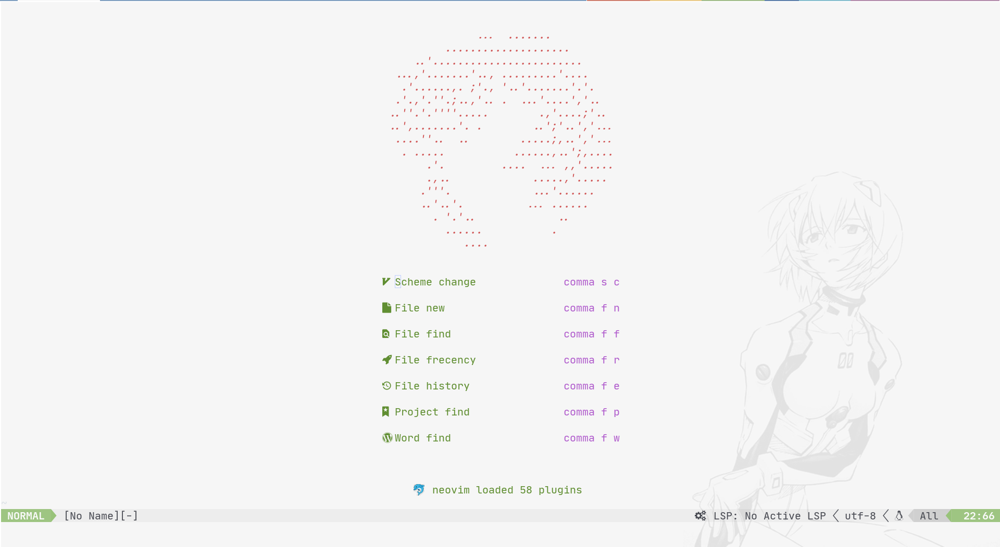
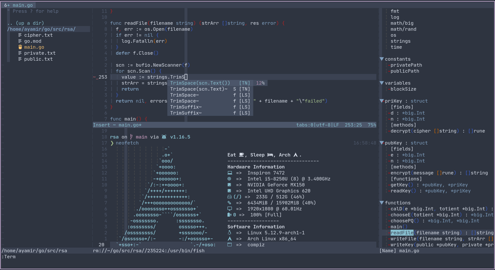

# Table of Contents

1. [Introduction](#introduction)
2. [Structure](#structure)
3. [Usage](#usage)

# Introduction

This is my neovim's configuration.

I use [Vim-Plug](https://github.com/junegunn/vim-plug) to manage plugins.

I use [coc.nvim](https://github.com/neoclide/coc.nvim) to realize completion.

# Structure

`init.vim` is the kernel config file.

The first part is the common settings of neovim.

The second part is Vim-Plug's settings which consist of all of my plugins.

The third part is common keybindings settings.

`plugin` directory includes some plugins' specific settings.

`coc-settings.json` is my `coc.nvim`'s settings.(golang, cpp, rust and [tabnine](https://github.com/codota/tabnine-vim) are configured.)

You need to learn how to use coc.nvim on your own.

# Usage

The leader key is space.

`<leader><leader>i` to use Vim-Plug install all of plugins.

`<leader><leader>u` to update all of plugins.

`<leader><leader>c` to clean redundant plugins.

You can see all of keybindings in my `init.vim`.
