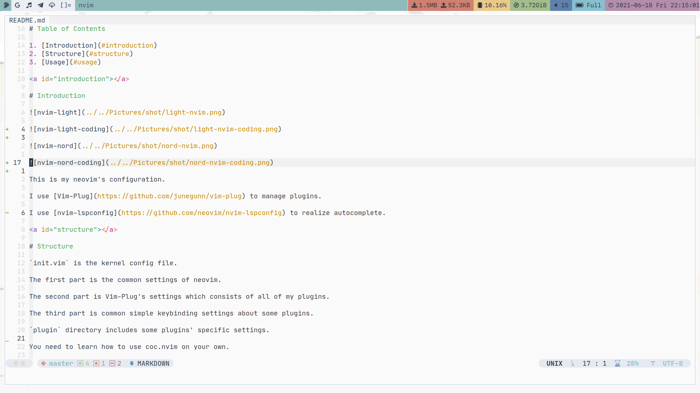
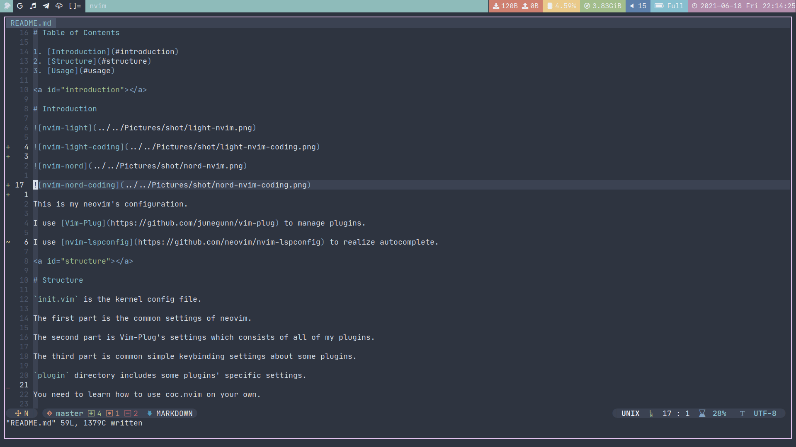

# Table of Contents

1. [Introduction](#introduction)
2. [Structure](#structure)
3. [Usage](#usage)

<a id="introduction"></a>

# Introduction







This is my neovim's configuration.

I use [Vim-Plug](https://github.com/junegunn/vim-plug) to manage plugins.

I use [nvim-lspconfig](https://github.com/neovim/nvim-lspconfig) to realize code complete.

<a id="structure"></a>

# Structure

`init.vim` is the kernel config file.

The first part is the common settings of neovim.

The second part is Vim-Plug's settings which consists of all of my plugins.

The third part is common simple keybinding settings about some plugins.

`plugin` directory includes some plugins' specific settings.

<a id="usage"></a>

# Usage

To make sure Vim-Plug can be downloaded normally, you should add this line to your `/etc/hosts`:

```shell
151.101.64.133 	raw.githubusercontent.com
```

The leader key is space.

`<leader><leader>i` to use Vim-Plug install all of plugins.

`<leader><leader>u` to update all of plugins.

`<leader><leader>c` to clean redundant plugins.

You can see all of keybindings in my `init.vim`.
