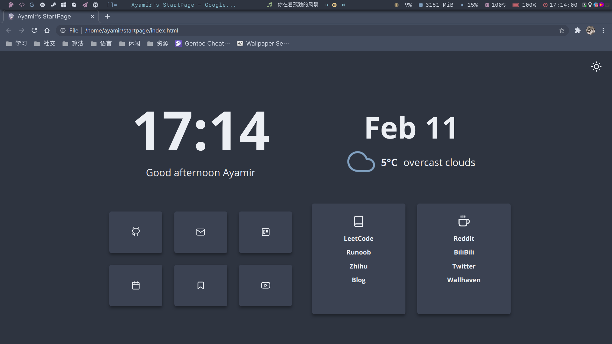
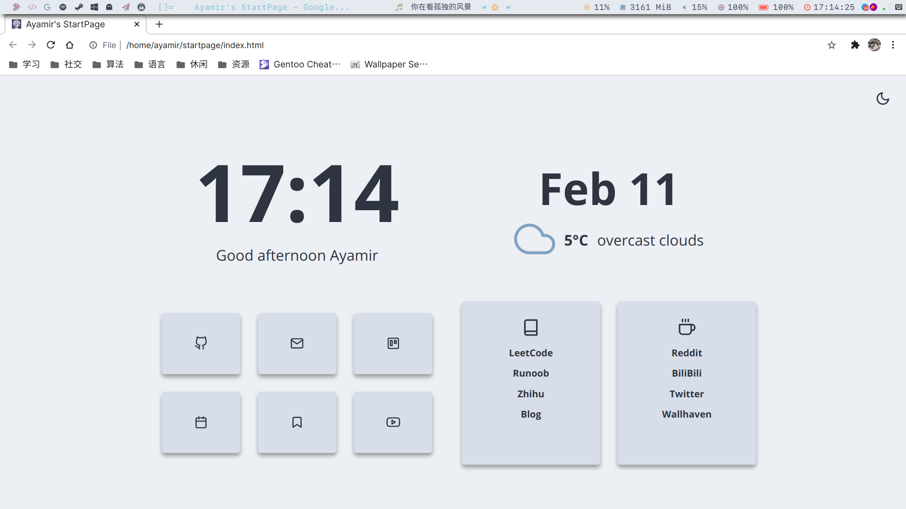

# Table of Contents

1.  [My Own Dwm Config](#org27716e3)
    1.  [Intro](#intro)
    2.  [Color Scheme](#org4976554)
    3.  [Dependency](#dependency)
    4.  [Usage](#usage)
    5.  [Other](#org1958ae2)
        1.  [Telegram Themes](#tg)
        2.  [Fcitx5 Themes](#fcitx5)
        3.  [Browser Themes](#browser)
    6.  [Credits](#credits)


<a id="org27716e3"></a>

# My Own Dwm Config

<a id="intro"></a>

## Intro

This repo collects apps' nord theme and 2 version dwm build.

[One](./.dwm-ori) with original dwm bar, [the other](./.dwm-po) with polybar(through patches).

Please use symlink to `~/.dwm`, so you can use [switch-dwm](./.local/bin/switch-dwm) to switch the two versions quickly.

```sh
# If you want to use original version
ln -s ./.dwm-ori ~/.dwm
# If you want to use ploybar version
ln -s ./.dwm-po ~/.dwm
```

<a id="org4976554"></a>

## Color Scheme

Nord and Light


<a id="dependency"></a>

## Dependency

+ Launcher: dmenu&rofi
+ Terminal: alacritty&kitty
+ Editor:
  + vim
  + doom emacs
  + vscode
  + sublime-text-nightly
+ Compositor: picom-jonaburg-git
+ Shell: fish
+ PDF reader: zathura
+ Player: mpd&ncmpcpp
+ Window switcher: rofi
+ Notification daemon: dunst
+ Screen locker: i3lock-color&xautolock
+ System monitor: conky
+ Theme controler: xsettingsd
+ Gtk themes:
  + Light: [Orchis-light](https://www.gnome-look.org/p/1357889/)
  + Dark: [Nordic](https://www.gnome-look.org/p/1267246/)
+ Qt themes:
  + use `qt5ct` and `qt5-styleplugins` to set qt theme follow gtk2 theme
+ Icon theme: [Papirus](https://www.gnome-look.org/p/1166289/)
+ Touchpad:
  + libinput
  + libinput-gestures
  + xdotool

<a id="usage"></a>

## Usage
1. Backup all of your old config files.
2. Install apps metioned in [Dependency](#dependency)
3. Copy all my config files to corresponding directories follow my repo's structure.
4. Please apply [polybar-dwm-module](https://github.com/mihirlad55/polybar-dwm-module) if you use the polybar version.
5. Please check [libinput-gestures](./.config/libinput-gestures.conf) to get corresponding quick gestures.

<a id="org1958ae2"></a>

## Other

<a id="tg"></a>

### Telegram Themes

Please refer this: [Nord-Tg](https://github.com/gilbertw1/telegram-nord-theme)

<a id="fcitx5"></a>

### Fcitx5 Themes

Please refer this: [Nord-Fcitx5](https://github.com/tonyfettes/fcitx5-nord)

<a id="browser"></a>

### Browser Themes

Set your browser just use default GTK theme.

You can use `Midnight Lizard` extension to realize web pages' nord color.

<a id="credits"></a>

## Credits

+ [Bento](https://github.com/MiguelRAvila/Bento) as my start page's template.




