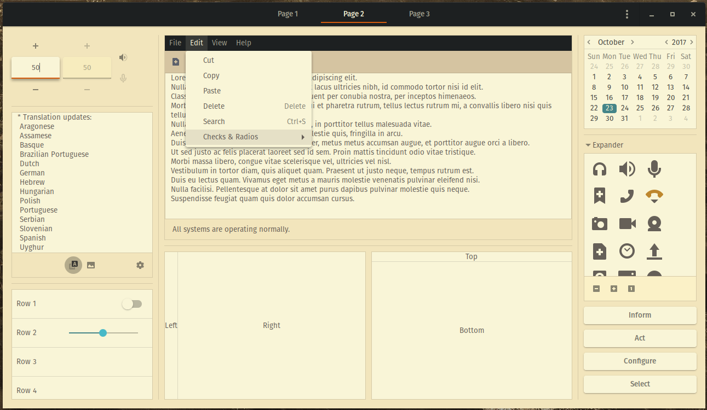
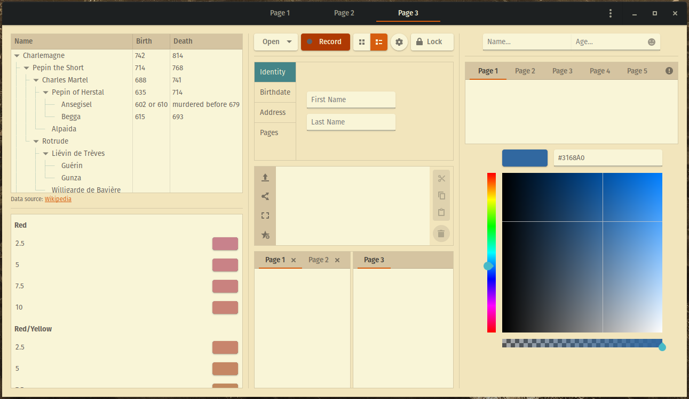
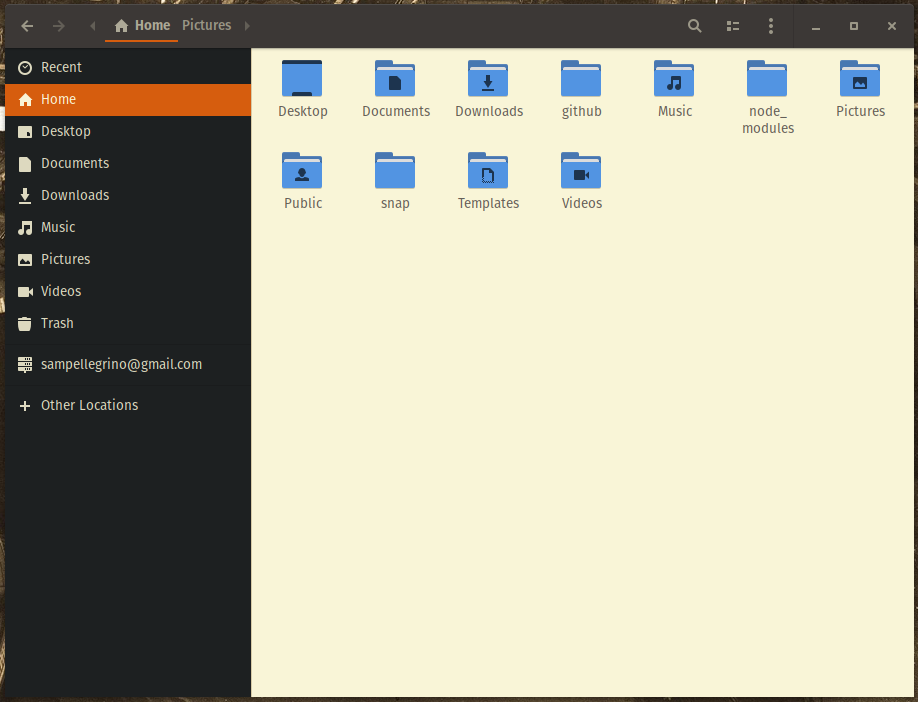
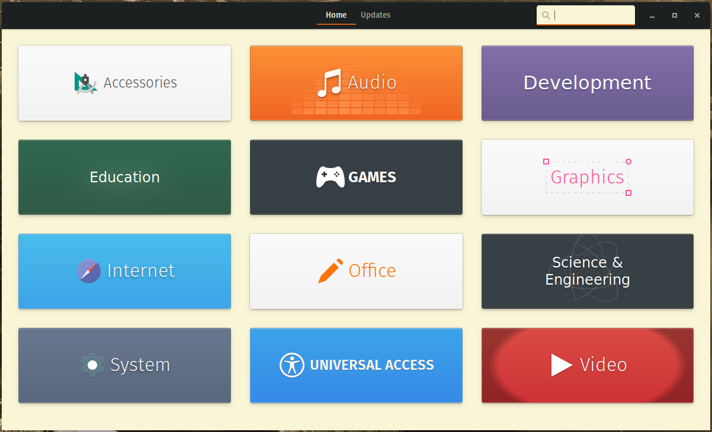
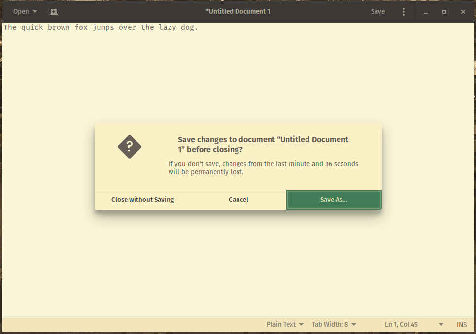

# Pop-gruvbox
Gruvbox theme based on Pop OS compact theme.

Color scheme from https://github.com/morhetz/gruvbox  
Theme based on https://github.com/system76/pop-gtk-theme

#### Color scheme hex and rgb is in the file `gruvbox_color_scheme` for theming other apps to match.
This file also include most changes made from default Pop colors.

## How to use
1. Put in ~/.themes/
1. Use tweaks tool to select Pop-gruvbox for the applications theme and shell theme

## GTK 3.22 theme
Uses the POP OS Compact theme as a starting point.  
Modified colorscheme to gruvbox colors.

## Gnome Shell theme
Uses the POP OS shell theme as the starting point.  
Modified colorscheme to use gruvbox colors.  
Topbar goes transparent when an app is not full screen.

